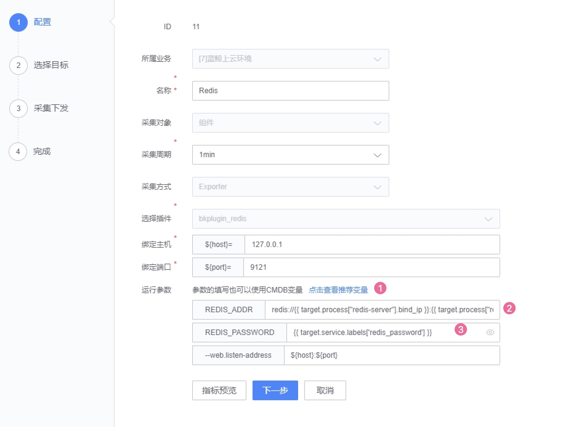

# 如何实现多实例采集

多实例指的是同样的一个服务，部署在相同服务器或者不同服务器的不同的配置情况。如：redis 在同一台服务器部署了 6379 和 6380 两个实例，并且两个实例的密码还不一样。

配置方法：

* 1) CMDB 配置多服务实例
* 2) 采集配置使用 CMDB 变量

## CMDB 配置多服务实例

**配置路径**：导航  →  业务  →  业务拓扑  →  模块设置  →  服务实例设置  →  进程设置  →  标签设置(可选)

服务实例的配置在服务拓扑(标识 1)

> **注意：** 如果在同一个模块(标识 2)下面有多实例的情况使用不了模版功能。需要使用自由的配置模式。

如图设置了两个 redis 服务实例，端口分别是 6379 和 6380(标识 3)。服务实例的概念具体查看[术语解释](../concepts/glossary.md)。

并且设置了`标签`功能(标识 4)，因为两个 redis 实例的密码不一样。标签： `redis_password`。

> **注意：** 从安全性的解决来说，一般是不建议密码存储在标签中的。

## 采集配置使用变量参数

* 标识 1：运行参数填写的变量可查看`点击查看推荐变量`
* 标识 2：选择不同的绑定 ip 和端口。 `{{target.process["redis-server"].bind_ip}}`   `{{target.process["redis-server"].port}}`

> 注意：redis-server 是进程名称。

* 标识 3：获取对应的密码，使用标签的功能 `{{target.service.labels['redis_password']}}`

更多的变量列表查看[变量列表](../functions/addenda/variables.md)。

## 动态采集和监控

采集的目标选择动态的方式，基于某个服务模块甚至是任意的节点。

监控的目标也选择动态的方式。
