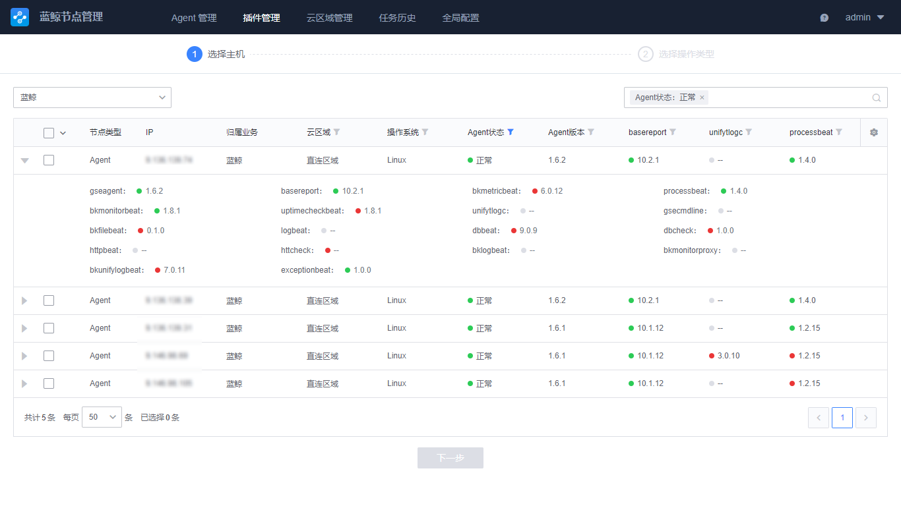
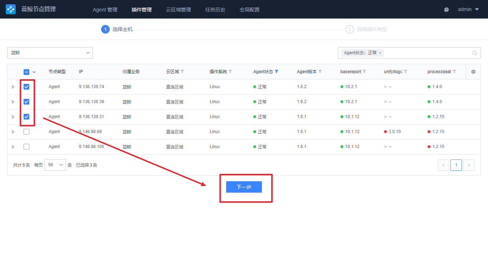

# 插件管理

插件是可由蓝鲸 Agent 调度的子程序或者脚本。蓝鲸 Agent 在安装到主机的时候会包含一些蓝鲸必备插件。

您可以通过插件管理功能更新这些插件，或者安装更多可选插件。

## 插件状态查询

点击主导航的“插件管理”进入到插件管理页面，在此页面中，您可以查询到当前主机的各个插件状态和版本号。



## 插件维护和安装

**第一步：选择操作目标**

选中需要管理的主机，点击下一步进入到管理页面。

注意：当前不支持 Windows 和 Linux 主机混合选中，建议先使用右上角的筛选功能先过滤操作系统，再进行选中维护。



**第二步：选择操作**

选择需要进行的操作和插件，即可以对插件进行操作。

对插件的维护包含以下操作：

- 启动：安装并启动插件程序
- 停止：停止插件功能
- 重启：重启插件程序，需插件支持
- 重载：通常用于配置更新，需插件支持
- 托管：托管给 Agent 管理后，当插件程序异常退出，Agent 会自动拉起此插件
- 取消托管：不使用托管功能
- 插件更新：更新插件到最新版本


## 添加新的插件包到节点管理

**第一步：获取插件包**

您可以通过以下途径获取到插件包：

1. 蓝鲸官网的[Smart 市场](https://bk.tencent.com/s-mart/)
2. 通过插件开发框架自定义开发的插件

**第二步：上传插件包**

获取新的插件包以后，需要上传到蓝鲸所部署的主机以下路径中：

`$BK_HOME/bknodeman/nodeman/official_plugin`

**第三步：刷新插件包**

还是在蓝鲸部署主机上，执行以下指令，刷新插件包到节点管理中。

```bash
workon bknodeman-nodeman
./bin/manage.sh init_official_plugins
```