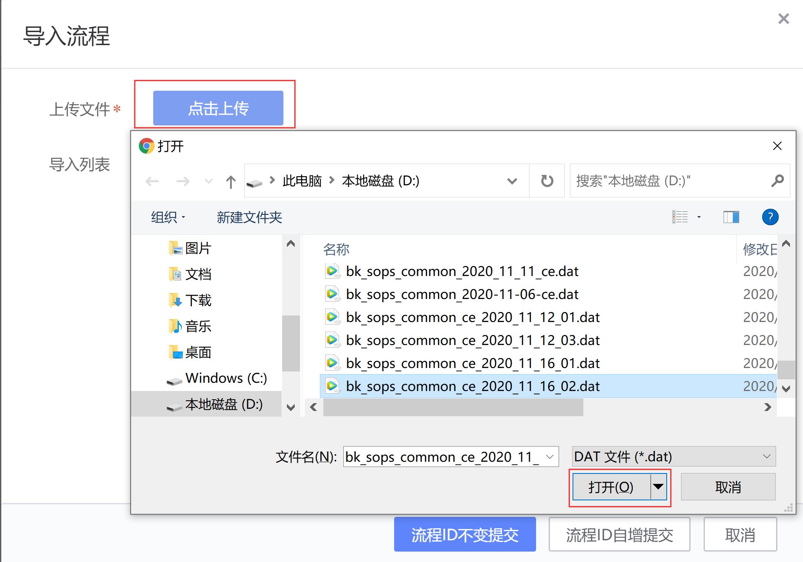
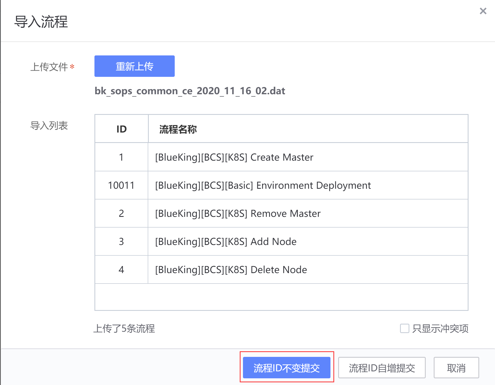
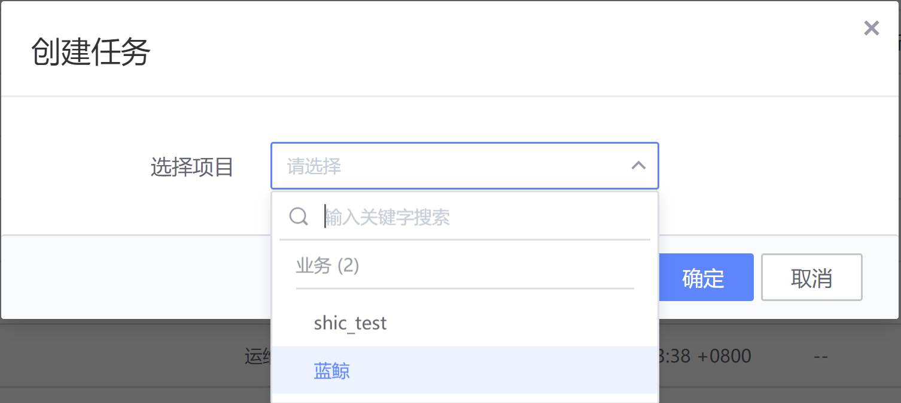
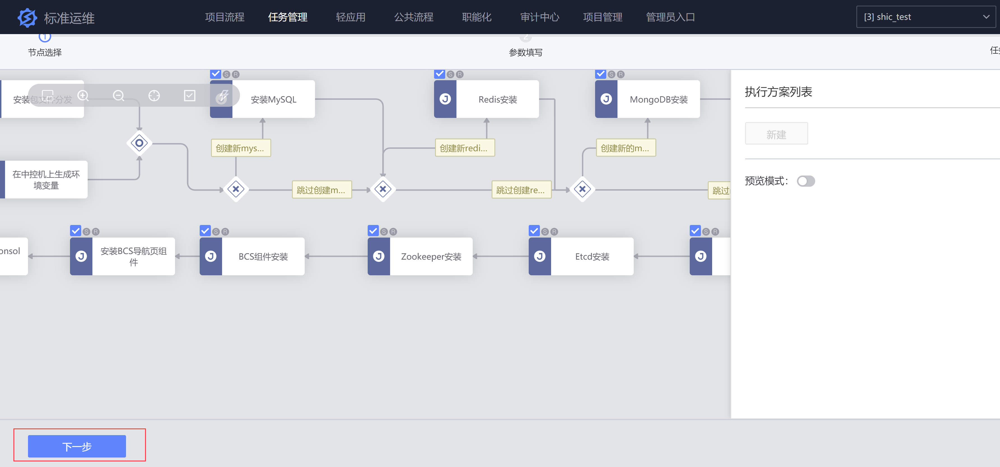
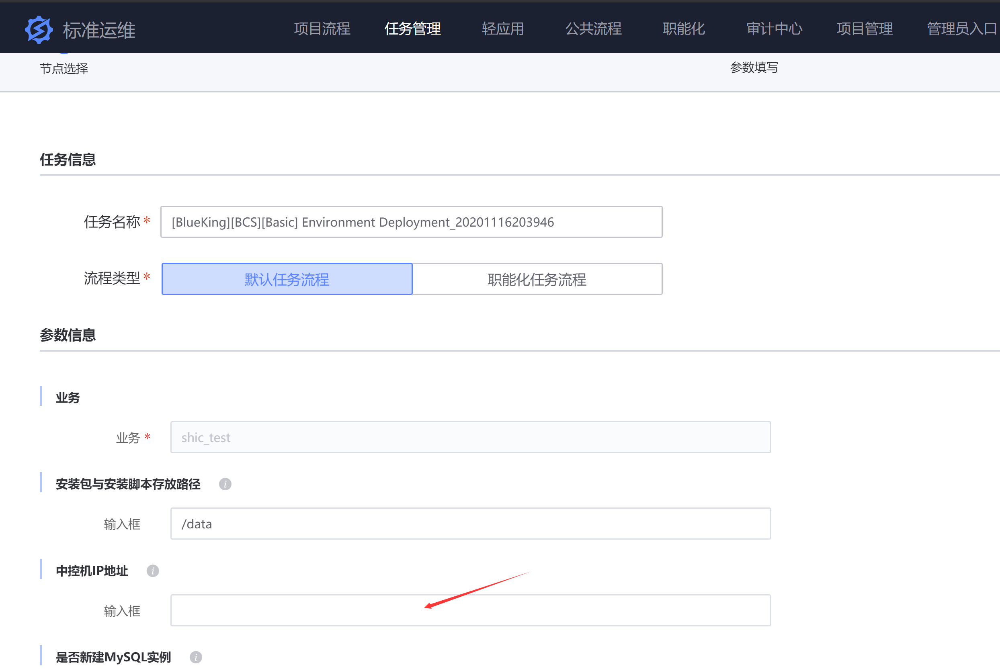

# 容器管理平台（BCS）快速部署

## 一、安装环境准备

### 1.1 基础环境依赖

> 若未部署蓝鲸基础环境，请参照[社区版 6.0 基础包快速部署](../../基础包安装/多机部署/quick_install.md)

部署容器管理平台（以下简称：BCS）须依赖社区版 6.0 基础环境，基础环境内必须包含 4 个基础平台和 4 个基础 SaaS：

1. **基础平台**
   - 管控平台
   - 配置平台
   - 作业平台
   - PaaS 平台
2. **基础 SaaS**
   - 用户管理
   - 权限中心
   - 节点管理
   - 标准运维

### 1.2 服务器资源准备

1. 建议操作系统： CentOS 7.6
2. 容器管理平台服务器配置与所需数量：4C 8G 两台、4C 4G 一台
   - 机器分布详解（请记录此处的机器编号，后续部署时需要填入）：
     - **机器 1**：MYSQL 数据库、MongoDB 数据库、Redis 数据库、Harbor 私有仓库（客户端浏览器可访问的 IP），最低使用 4 核 CPU|8G 内存|200G 磁盘（1 台）
     - **机器 2**：BCS 后台服务、BCS 导航页（客户端浏览器可访问的 IP）、web_console 服务，最低使用 4 核 CPU|8G 内存|100G 磁盘（1 台）
     - **机器 3**：容器监控服务，最低使用 4 核 CPU|4G 内存|100G 磁盘（1 台）
3. 服务器网络要与安装蓝鲸社区版基础包的服务器相通，在配置平台中需放在“蓝鲸”业务下
4. 容器管理平台服务器不能与 K8S 集群服务器、蓝鲸基础服务服务器共用，需要独立申请，否则会导致端口冲突等环境问题
5. K8S 集群服务器不能与容器管理平台服务器、蓝鲸基础服务服务器共用，需要独立申请，否则会导致端口冲突等环境问题
6. Harbor 私有仓库 IP 地址、BCS 导航页组件 IP 地址与 BCS 监控 IP 地址都会占用 TCP 80 端口，需要部署在 3 台不同的服务器上以免端口冲突

### 1.3 安装 BCS 部署机器的 GSE Agent

- 安装方法，请参考“快速入门”中“[【节点管理】Agent 安装](../../../../节点管理/产品白皮书/QuickStart/DefaultAreaInstallAgent.md)”
- 安装时业务请选择“蓝鲸”

### 1.4 下载 BCS 安装包

- 下载安装包，当前为灰度体验中，下载地址请参照灰度邮件（灰度资格申请：[https://bk.tencent.com/s-mart/community/question/1380](https://bk.tencent.com/s-mart/community/question/1380)）
- 上传安装包至中控机 /data
- 容器管理平台扩展软件包：bcs_ce-6.0.3.tgz

### 1.5 下载标准运维模版文件

- 下载模版文件至本地
- 标准运维模版文件名：bk_sops_common_ce_2020_11_16_03.dat

### 1.6 解压 BCS 安装包

```bash
tar xvf bcs_ce-6.0.3.tgz -C /data/
```

## 二、开始部署

### 2.1 导入标准运维模版

打开标准运维--->公共流程--->导入--->点击上传--->选择标准运维模版文件名--->流程 ID 不变提交

（因为 bcs-ops 模块需要关联标准运维模版流程 ID，如果流程 ID 有冲突请参考[增强包维护手册-BCS-FAQ](../../维护手册/增强包/BCS/FAQ.md)的第 2 小点解决）






### 2.2 新建任务

打开标准运维--->公共流程--->[BlueKing][BCS][Basic] Environment Deployment--->新建任务


### 2.3 选择“蓝鲸”业务



### 2.4 节点选择，不用修改，直接进入下一步



### 2.5 参数填写




### 2.6 执行部署作业

执行作业过程中没有出现错误即部署正常，否则需要根据 job 执行错误信息解决问题。


## 三、访问容器管理平台
### 3.1 添加 hosts 解析或域名解析

```bash
# Linux、Mac：/etc/hosts，Windows：C:\Windows\System32\drivers\etc\hosts
# BCS导航页组件IP地址（客户端浏览器可访问的地址） BCS导航页域名（BCS导航页域名前缀.蓝鲸基础域名） BCS导航页API域名（api-BCS导航页域名前缀.蓝鲸基础域名）
# 例如：
110.111.112.113 bcs.bktencent.com api-bcs.bktencent.com
```
### 3.2 访问容器管理平台 SaaS

刷新蓝鲸工作台，会出现一个容器管理平台的 SaaS，点击图标会跳转到蓝鲸容器管理平台的 console 页面，也可以直接访问 URL [http://bcs.bktencent.com](http://bcs.bktencent.com) 来访问容器管理平台，如果无法访问时，可能是 hosts 域名解析没有生效，可以关闭浏览器后重试。

### 3.3 容器管理平台部署完毕

完成以上步骤容器管理平台就已经部署完毕。


